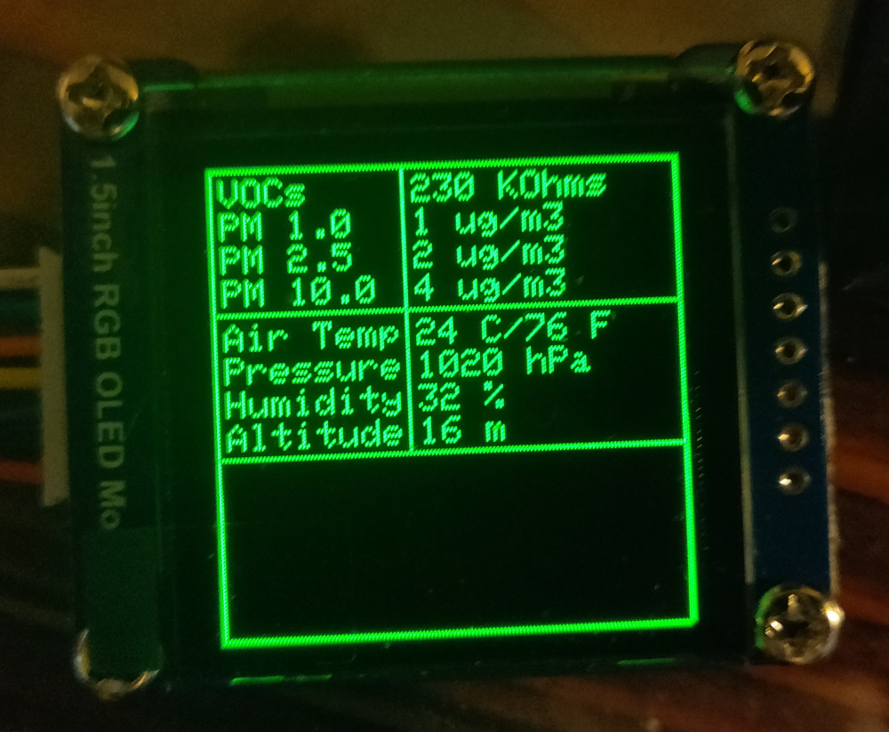
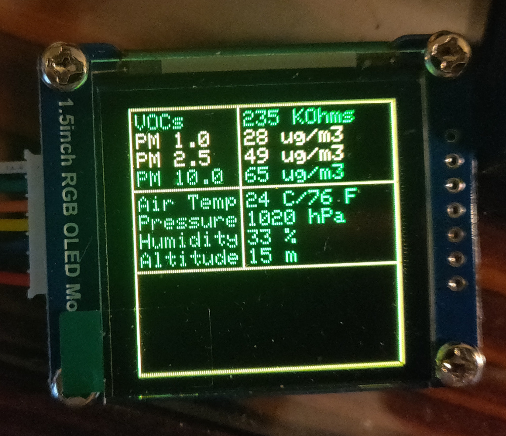
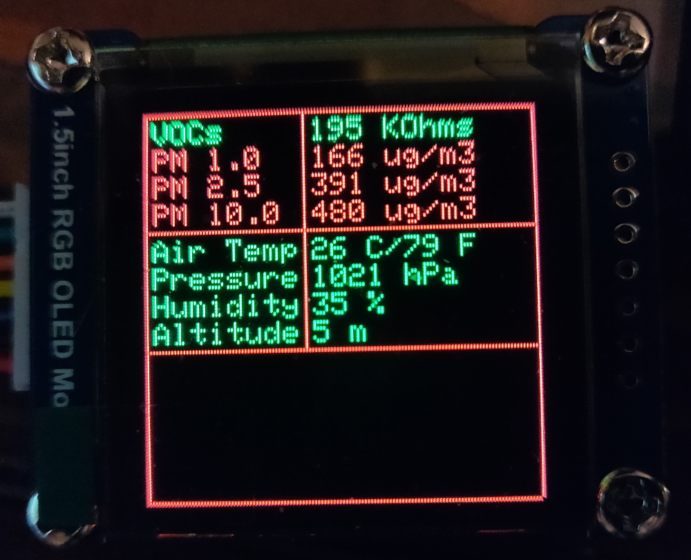

# real-time-air-monitor
## Project Summary

This is an EASY Arduino project that drives a Volatile Organic Compound (abbreviated as VOC) sensor alongside a Particulate Matter (abbreviated as PM) sensor. Output is to a 128x128 OLED display.

This project exists to solve several problems: 

* [Air Quality Index calculations](https://en.wikipedia.org/wiki/Air_quality_index#Computing_the_AQI) often require several hours of aggregate data before a calculation can be made. This project is for when you want to get an idea about what's in the air around you *right now*.
* Air quality sensors are expensive 
* Building stuff is fun!  
* I thought other people might be able to use this as a starting point for their air monitoring projects.  

The UI changes colors depending on how clean the air is. For example:

<a href="./IMAGES/NO_ALERT_STATE.jpg">No Alerts</a>
<a href="./IMAGES/WARN_STATE.jpg">Warning</a>
<a href="./IMAGES/ALERT_STATE.jpg">Alerting</a>

## DISCLAIMER!

Everyone knows you shouldn't breathe bad air. This project is NOT medical advice. Use common sense before relying on D.I.Y. electronics - and advice from the internet - when your health is at stake, please. 

You are responsible for calibrating these sensors to your environment. If you are getting strange readings from the sensors, I will have very limited ability to help. It pays to have the documentation on-hand when working on a project like this.

## What you need to build your own:

At very minimum, you will need to have:

1. An Arduino Uno (or compatible)
1. Plantower PMS7003M (I used [this one](https://www.ebay.com/itm/PMS7003M-High-Precision-Laser-Dust-Sensor-Module-PM2-5-PM10-Cable-for-Arduino-/142619414418)). A Plantower PMS7003 should also work, but I didn't have one to test with.
1. A BME680 breakout board (I used [this one](https://www.amazon.com/gp/product/B07CSPJ4KL/))
1. WaveShare 1.5 inch 128x128 RGB OLED module (I used [this one](https://www.amazon.com/gp/product/B07DB5YFGW/))
1. A solderless breadboard and some jumper wires
1. A USB cable
1. A computer with the Arduino IDE installed
1. Several Arduino Libraries installed in the IDE (all of them are available in the Library Manager)
	1. [PMS Library](https://github.com/fu-hsi/pms)
	1. [Adafruit GFX Library](https://github.com/adafruit/Adafruit-GFX-Library)
	1. [Adafruit SSD1341 Library](https://github.com/adafruit/Adafruit-SSD1351-library)
	1. [AltSoftSerial](https://www.pjrc.com/teensy/td_libs_AltSoftSerial.html)
	1. [Adafruit Unified Sensor Driver](https://github.com/adafruit/Adafruit_Sensor)
	1. [Adafruit BME680 Library](https://github.com/adafruit/Adafruit_BME680)

Estimated cost of components before shipping and taxes: ~$100USD

## Wiring up this project

I will try to make this as simple as I can. It is possible to change this but please remember to change the code if you change the wiring.

### Start here

<b>The first step</b> should be to address the power and ground for each device. The PMS7003M requires 5 volts, but the OLED and BME680 can both run off of 3.3 volts. An Arduino Uno has one port for 5v, and one for 3.3v, so the OLED and BME680 will need to share. Connect a jumper wire from the 3.3v pin on the Arduino Uno to the power rail on your breadboard. Do the same with a ground port on the Arduino, and the ground rail on your breadboard.
 

<em>Throughout the rest of this guide,</em> the :arrow_right: symbol will represent a wire that needs to be placed by you. Pay attention to them!

**Arduino 3.3v** :arrow_right: **Breadboard power rail**  
**Arduino GND** :arrow_right: **Breadboard ground rail**

### The pins on the BME680 should be connected to the Arduino this way:

You'll be connecting four wires to the BME680.

**Arduino SCL** :arrow_right: **BME680 SCL**  
**Arduino SDA** :arrow_right: **BME680 SDA**  
**Breadboard power rail** :arrow_right: **BME680 VCC**  
**Breadboard ground rail** :arrow_right: **BME680 GND**  

### The pins on the PMS7003M should be connected to the Arduino this way:

The PMS7003M has a few different connectors on it. We're interested in the 4 pins labeled 'P3', and they can be hard to see. Take your time.

**Arduino 5V** :arrow_right: **PMS7003M VCC**  
**Arduino GND** :arrow_right: **PMS7003M GND**  
**Arduino 9** :arrow_right: **PMS7003M RX**  
**Arduino 8** :arrow_right: **PMS7003M TX**  

### The pins on the OLED should be connected to the Arduino this way:

The display is configured to use hardware SPI. The Arduino Uno only has one hardware SPI interface, so some of these pins can't change. They have been labeled.

**Arduino 11** :arrow_right: **OLED DIN** (This can't change)   
**Arduino 13** :arrow_right: **OLED CLK**  (This can't change)  
**Arduino 10** :arrow_right: **OLED CS**  
**Arduino 4** :arrow_right: **OLED DC**  
**Arduino 6** :arrow_right: **OLED RST**  
**Breadboard power rail** :arrow_right: **OLED VCC**  
**Breadboard ground rail** :arrow_right: **OLED GND**  

## Using this sketch

This sketch should work out-of-the-box if you wire yours the same way I wired mine and everything is connected correctly. However, you will need to calibrate it to get correct results. The hardware calibrations instructions are out-of-scope for this document, but the PMS7003M and BME680 documentation is very good.

One thing you will have to do is to set the sea-level pressure for YOUR location and time. This will give you the most accurate pressure and altitude measurements, but unfortunately changes constantly. Check your local weather and, if you need to, convert the local data into Hectopascals (hPa). There is a variable in the sketch called SEALEVELPRESSURE_HPA, replace the value in the sketch with your current local weather conditions.

This sketch is also designed to leave room for you to experiment and play! There's an entire section of the display left blank for you, and there are plenty of open pins on the Arduino.

If you're looking for ideas on what to add, here are a few suggestions: 

* A Real Time Clock (RTC) module, and a time-of-day animation 
* A scrolling text marquee that changes based on sensor input
* Add some buttons, and a digital pet that reacts to user input AND environment effects
* Add a wireless network adapter and a GPS, so the Arduino can look up the sea-level pressure on its own

## Understanding the data
### VOCs

Output is measured in KOhms (kilo ohms). Lower numbers are bad, higher numbers are good.
 

This sensor is on the BME680. It usually takes a few minutes to start giving accurate measurements. Let it run for at least 10 minutes before trusting the output.
 

You can test your VOC sensor in several ways. Breathing on the sensor will have an obvious effect. If you'd rather see a big change, hold the cap from a bottle of rubbing alcohol near the sensor.

### Particulate Matter
**PM1.0** - solid and liquid particles smaller than 1.0 micrometer in diameter.  
**PM2.5** - solid and liquid particles smaller than 2.5 micrometers in diameter.  
**PM10.0** - solid and liquid particles smaller than 10.0 micrometers in diameter.  

Output is measured in ug/m3 (more accurately: µg/m3, or micro grams per cubic meter). Ideally you want these numbers to be as close as possible to zero. The "u" character is used instead of "µ" due to character limitations. It may be possible, I just haven't figured it out yet.

The PMS7003M is the particulate matter sensor, and all of these readings come from it. That device can take up to 30 minutes to give accurate readings.

You can test your PMS7003M in many ways. Here are a few ideas: cooking on your stove, blowing out a candle, using sandpaper or a sanding device.

### Other data

The BME680 has sensors for temperature, atmospheric pressure, relative humidity, and altitude so those have been included. They are useful things to know but they are not the focus of this project. As such, I don't plan to explain them in great detail.

**Air Temp** - output is in Celsius and Fahrenheit.  
**Pressure** - output is in hPa (hectopascals, which are equivalent to millibar).  
**Humidity** - output is in % relative humidity.   
**Altitude** - output is in meters.  

Mentioned above is the SEALEVELPRESSURE_HPA variable in the sketch. This value will be different every day, and will always be different for you and I. The pressure and altitude calculations use this value. It is a good idea to keep it up-to-date when you are using this device. 

### Useful functions

If you decide to modify this code, there are a few functions you might be able to modify or reuse.

**printLinePlus()** - This function will concatenate several string inputs and an integer input, and print them in the desired color. This is useful when you're trying to print on both sides of a vertical line, instead of drawing over the top of the line - which creates a blinking-line effect that is best avoided. 
 
**printBorders()** - This function will draw all of the lines in the color specified.  
 
**print\<\<sensor name\>\>()** - There is a function with a name for each of the sensors listed in the previous section. Example: **printHumidity()**. These functions are where the warning and alert thresholds are defined for each type of data.  

## Further reading
- The DATASHEETS directory in this repository is full of PDFs related to the hardware. If you are looking for calibration information, you should start there. They also include information about how the sensors function.
- [The documentation for the Adafruit GFX Library](https://learn.adafruit.com/adafruit-gfx-graphics-library/overview) is *awesome*. 
- All of the Github repos linked in the libraries section above are potentially useful.

## Feedback

I'm relavtively new to Arduino, so please let me know if this can be improved. All feedback is welcome. If you have a problem with any part of this repository, please open an issue. For other inquiries please contact me directly.

